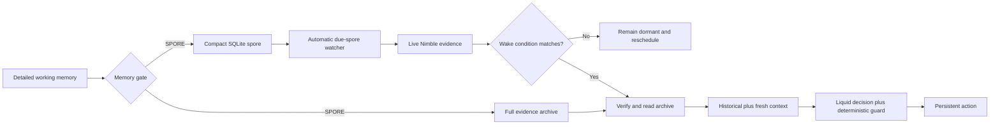
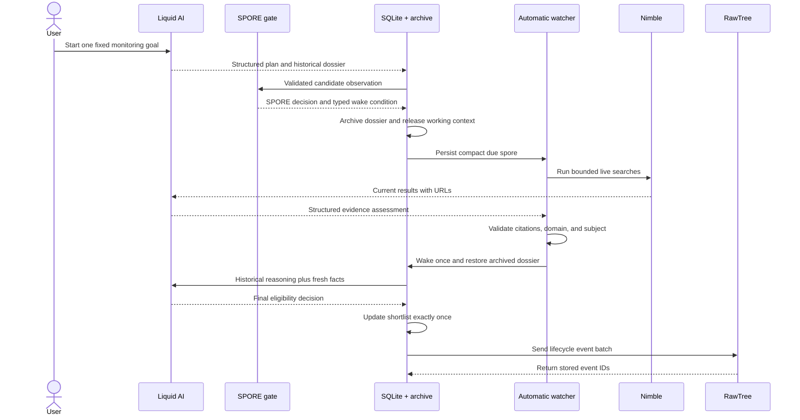

# SPORE

**Forget intelligently. Remember at the right moment.**

Semantic Persistence & On-demand Rehydration Engine.

SPORE is a hackathon project exploring conditional memory for long-running agents. An observation that is irrelevant now can leave working context while retaining a compact wake condition, historical rationale, and a recipe for reconstructing relevant context later.

## Explain it like I am new here

Imagine an analyst with a desk and a filing cabinet. The desk is the AI's limited working context. If every old investigation stays on the desk, new work becomes slower, more expensive, and harder to reason about. If the analyst throws every rejected investigation away, useful reasoning disappears.

SPORE adds a third option: file the complete investigation safely, leave a small reminder card containing the exact condition that would make it useful again, and automatically bring the file back when that condition changes.

| SPORE concept | Everyday analogy | What the project uses |
| --- | --- | --- |
| Working memory | Papers on the analyst's desk | A SQLite `working_memories` row containing the current detailed payload |
| Archive | The filing cabinet | A checksum-protected JSON evidence file |
| Spore | A small reminder card | A compact SQLite row with a blocker, wake condition, query, schedule, and archive pointer |
| Watcher | An alarm clock | `AutonomousWatcher.start()` checks due spores without a wake button |
| Fresh evidence | The analyst checking what changed | Live Nimble searches with inspectable URLs |
| Rehydration | Taking the old file back out | Historical evidence plus the newly observed facts |
| Action | Updating the analyst's recommendation | A persistent shortlist or rejection record |
| Audit trail | A security camera and activity log | RawTree lifecycle events that are written and read back |

The one-sentence version is:

> **SPORE lets an AI put old research to sleep, notice when the world changes, wake the right memory, and continue working from where it stopped.**

## When does information become a SPORE?

The memory gate follows deterministic rules in this order:

| Question | Result |
| --- | --- |
| Is it duplicate, irrelevant, or noise? | `DISCARD` |
| Is it a standing rule or continuing preference? | `DURABLE` |
| Is the task unfinished, needed now, or already eligible? | `ACTIVE` |
| Is it a completed candidate evaluation, currently blocked by a fact that can change, with a precise supported wake condition? | `SPORE` |
| Does it fit none of these roles? | `DISCARD` |

A provider moves to `SPORE` only when all of these are true:

1. The observation is relevant.
2. The evaluation is complete; it is not unfinished work.
3. The provider is not currently eligible or needed.
4. The reason it failed is a fact that can change.
5. The agent can express exactly what should wake it, such as `api_documentation_available == true` or `monthly_price <= 100`.

This prevents vague reminders such as “check this again sometime.” A spore needs a machine-checkable reason to return.

## Where does old memory live, and how does it return?



The full historical dossier is not kept inside the model. SQLite keeps the small control record and archive pointer; the archive keeps the detailed evidence. When the watcher finds a match, SPORE verifies the archive checksum and reconstructs the context from the old dossier plus fresh web facts.

The current demonstration time-compresses one clearly labelled historical checkpoint and one present-day check into a single run. It does not claim to search an unlimited lifetime of prior conversations. The reusable watcher itself asks SQLite for **all dormant spores that are due**, so the storage and scheduling layer supports more than one spore even though the verified UI scenario seeds one.

Starting the verified demo again deliberately resets its local demo database and archive before rebuilding the scenario. This makes judging repeatable. The core SQLite and archive classes are persistent and do not require that reset outside the demo controller.

## The complete autonomous run



After one click, the application performs these phases without individual stage buttons:

1. Liquid turns the fixed goal into a structured research plan.
2. SQLite holds a realistic historical provider dossier while the gate evaluates it.
3. The deterministic gate classifies the dossier as a `SPORE`.
4. The complete dossier is archived and removed from working memory.
5. `AutonomousWatcher.start()` starts the due check automatically.
6. Nimble runs three live searches; Liquid interprets the results.
7. A source guard accepts only returned URLs from the official `openai.com` domain family that specifically concern Responses API documentation.
8. The memory wakes once, the SHA-256 archive check passes, and the historical dossier is restored.
9. Liquid makes the final decision; a deterministic evaluator blocks disagreement.
10. The agent updates its shortlist and RawTree verifies the complete event sequence.

## Why the released-context number is meaningful

The original minimal checkpoint was only 294 estimated tokens. That proved the mechanism but did not communicate realistic impact. The verified scenario now uses a structured vendor due-diligence dossier containing:

- 20 evaluation dimensions with acceptance evidence;
- 12 identified risks and controls;
- a 12-step implementation plan;
- decision history, operating principles, research notes, requirements, and source provenance.

The token figure shown in the dashboard is measured from the actual serialized dossier using the documented `serialized bytes / 4` estimate. The reduction percentage compares the archived evidence size with the compact spore size; neither number is hard-coded as a claimed result.

In a real research agent, several provider dossiers could be dormant simultaneously. Releasing thousands of tokens per blocked candidate avoids sending the same completed research through every later model call.

## Current status

The repository is a finalized development baseline. The local build observatory runs, live connection checks have verified Nimble search and RawTree event write/read access, and three Liquid models are available locally through Ollama.

The first memory-gate evaluation showed that an LLM cannot safely own lifecycle decisions by itself: the 1.2B instruct model passed 1/8 strict cases, the 2.6B reasoning model did not produce usable short structured responses, and the 8B-A1B model understood the SPORE case but still omitted a required trigger field. The implementation will therefore combine Liquid-assisted extraction with a deterministic policy, schema validation, and fail-closed behavior.

The project now implements the complete autonomous memory lifecycle: Liquid plans a bounded research task, Nimble executes multiple live searches, a guarded Liquid evidence assessment cites official sources, the deterministic gate creates a dormant SPORE, and `AutonomousWatcher.start()` runs the due check without a wake button. The agent then rehydrates its archived rationale, makes a guarded Liquid decision, updates its persistent shortlist, and sends the lifecycle to RawTree for read-back verification.

The local dashboard starts that entire flow from one goal. A separate explain mode still exposes individual components. A read-only public proof site is generated from the latest verified run so visitors cannot access credentials or spend trial credits.

## Intended demonstration

1. The user gives the scout one monitoring goal.
2. Liquid creates a structured plan with multiple searches, official domains, and a typed wake condition.
3. The memory gate turns a dated historical checkpoint into a dormant SPORE and removes its detailed payload from working context.
4. The scheduler starts itself; Nimble researches the live web and Liquid assesses the results behind an official-source guard.
5. When the condition is satisfied, the agent restores archived rationale, reevaluates the provider with Liquid, updates its shortlist exactly once, and verifies its RawTree audit trail.

The demo must distinguish real observations from fixtures or historical replay. A manual wake button does not establish autonomous detection. All context savings and usefulness metrics must be measured, not hard-coded as results.

## Tools and why each is necessary

| Service | Role | Status |
| --- | --- | --- |
| Liquid AI through Ollama | Creates the search plan, interprets web evidence, and makes the post-wake decision using strict structured output | Local 8B model used in the verified path; deterministic validation remains authoritative |
| Nimble | Gives the watcher current web results with titles, descriptions, and inspectable source URLs | Three bounded searches per autonomous run |
| SQLite | Stores runs, working memories, durable memories, spores, shortlist entries, and actions | Local persistent control plane with uniqueness constraints |
| Checksum-protected archive | Stores the complete evidence removed from working context | SHA-256 verified before rehydration |
| Tinybird / RawTree | Holds the external lifecycle audit trail | One batch per completed run, followed by event-ID read-back verification |
| Local dashboard | Shows each decision, tool, source, storage transition, metric, and final action | Credentials remain on the local server |
| GitHub Pages | Shows a sanitized public proof | Read-only; cannot spend API credits or reach local secrets |

AWS is not required for this implementation because the verified path uses local inference, SQLite, and a local evidence archive.

## Code map

| Area | Purpose |
| --- | --- |
| `src/demo/autonomous-controller.mjs` | Conducts the entire one-command autonomous run |
| `src/demo/historical-dossier.mjs` | Builds the realistic historical research payload whose measured context is released |
| `src/memory/policy.mjs` | Contains the deterministic `ACTIVE`, `DURABLE`, `SPORE`, and `DISCARD` rules |
| `src/memory/lifecycle.mjs` | Archives evidence before transactionally removing working memory |
| `src/storage/sqlite.mjs` | Defines persistent memory, spore, shortlist, and action tables |
| `src/storage/archive.mjs` | Writes and verifies checksum-protected historical evidence |
| `src/watcher/watcher.mjs` | Schedules due spores, runs checks, reschedules misses, and wakes matches once |
| `src/watcher/conditions.mjs` | Evaluates typed boolean and numeric wake conditions |
| `src/integrations/liquid.mjs` | Calls local Liquid structured output for planning, evidence assessment, and reevaluation |
| `src/integrations/nimble.mjs` | Runs bounded authenticated searches and normalizes returned evidence |
| `src/integrations/rawtree.mjs` | Sends lifecycle events and queries them back by run ID |
| `src/agent/rehydrate-and-act.mjs` | Combines archived and fresh evidence, then writes the one-time action |
| `src/domain/` | Rejects malformed observations, plans, citations, decisions, and model output |
| `src/telemetry/` | Creates stable lifecycle events, measured metrics, and a disk-backed retry buffer |
| `dashboard/` | Serves the local interactive console without exposing credentials to browser code |
| `docs/` | Contains the sanitized public GitHub Pages proof |
| `tests/` | Verifies policy, validation, persistence, integrity, scheduling, idempotency, integrations, and the full autonomous loop |

## Local console versus public site

| Local console | Public GitHub Pages site |
| --- | --- |
| Can start a new live autonomous run | Displays a sanitized completed run |
| Can call local Liquid, Nimble, and RawTree | Has no writable API routes |
| Reads credentials from the server-side `.env` | Contains no credentials |
| Uses trial credits during an explicit run | Uses no trial credits when visitors open it |
| Shows persistent local SQLite and archive state | Shows only the deliberately published proof |

The verified goal is intentionally narrow: monitor the OpenAI Responses API until official reference documentation is available. The fixed scope keeps the live demonstration reliable and prevents the UI from claiming general research support that has not been built.

## Setup

See [the setup checklist](docs/SETUP.md). Copy `.env.example` to `.env` for local settings. `.env` and runtime data are excluded from Git.

Verify the local development environment without spending remote API credits:

```sh
npm run doctor
npm run check
```

Inspect the four-state memory gate on the representative scenarios:

```sh
npm run gate:demo
```

Inspect the local SQLite memory records without creating a persistent file:

```sh
npm run storage:demo
```

Inspect the archive-and-forget lifecycle using temporary local storage:

```sh
npm run lifecycle:demo
```

Run the watcher with explicitly labeled historical-replay evidence and no API credits:

```sh
npm run watcher:demo
```

Run the complete archive, wake, rehydrate, reevaluate, and shortlist flow with replay evidence:

```sh
npm run action:demo
```

Measure that full replay lifecycle locally without spending credits:

```sh
npm run telemetry:demo
```

Send one labeled test batch to RawTree and verify it by reading the event IDs back:

```sh
npm run telemetry:live
```

Run the local build observatory:

```sh
npm run dev
```

Then open `http://127.0.0.1:4317`. The page reports recorded milestones and checks live Ollama health; it does not expose credentials. Click **Start autonomous agent** once. The remaining phases run without stage buttons. The verified scenario uses one fixed Responses API goal. Starting it again clears the previous autonomous database and archive, then repeats the complete pipeline with three live Nimble searches and one RawTree event batch.

The optional explain mode exposes the older seven-stage flow for component inspection. It persists inspectable state in `data/spore-demo.sqlite` and detailed evidence in `data/spore-demo-archives/`. The same stages can be run from a terminal:

```sh
npm run demo -- reset
npm run demo -- observe
npm run demo -- classify
npm run demo -- sleep
npm run demo -- wake-live
npm run demo -- rehydrate
npm run demo -- act
npm run demo -- telemetry
```

`wake-live` uses one Nimble search. `wake-replay` is the labeled, repeatable alternative. The final telemetry stage sends one labeled batch to RawTree and verifies it by read-back.

Generate the read-only GitHub Pages proof from the latest successful run:

```sh
npm run site:build
```

The generated `docs/` site contains sanitized run evidence and no credentials or writable API routes.

## Event

[Long Horizon Agents Hack](https://tokensand.com/horizonagentshack), September 25, 2026.

The repository and sanitized proof site are public for the event.
