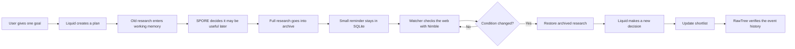
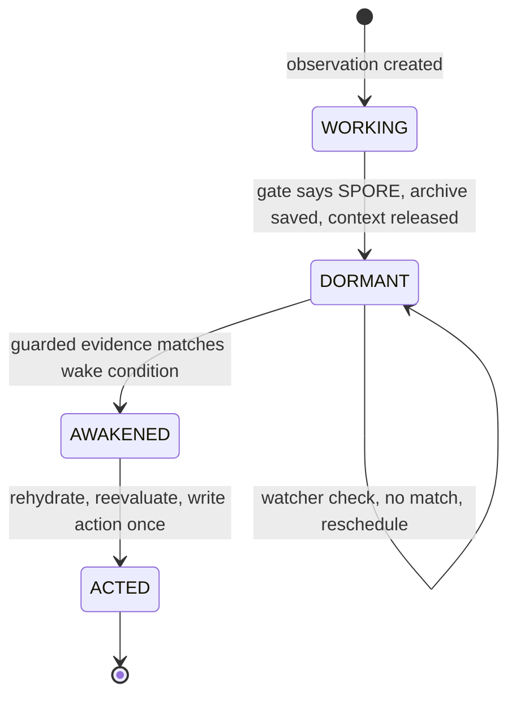
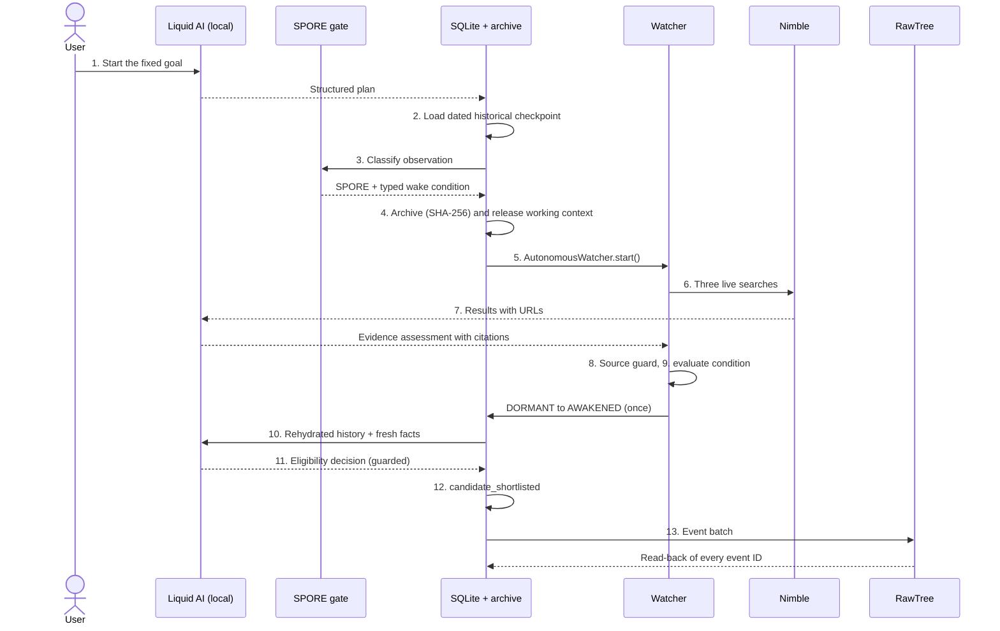
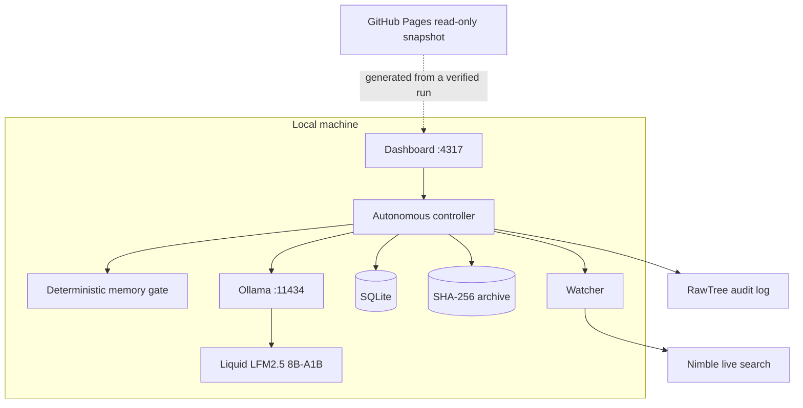

# SPORE

**Forget intelligently. Remember at the right moment.**

*Semantic Persistence & On-demand Rehydration Engine* — conditional memory for long-running AI agents.

> **SPORE lets an AI safely put old research to sleep, automatically notice when the world changes, wake the right memory, and continue working from where it stopped.**

| | |
| --- | --- |
| Public read-only demo | [karthikshetty-1629.github.io/spore](https://karthikshetty-1629.github.io/spore/) |
| Local agent console | `http://127.0.0.1:4317` (after `npm run dev`) |
| Event | [Long Horizon Agents Hack](https://tokensand.com/horizonagentshack), September 25, 2026 |
| Sponsor tools in the working path | Liquid AI · Nimble · RawTree |
| Automated tests | 52 passing (`npm test`) |

---

## SPORE explained for someone seeing it for the first time

Imagine hiring a researcher and giving them this task:

> "Keep checking OpenAI. If proper documentation for its Responses API becomes available, reconsider it and add it to our approved list."

A normal AI agent has two bad choices. SPORE adds a third:

| Option | What happens | Problem |
| --- | --- | --- |
| 1. Remember everything | Every old research note stays in the agent's immediate memory forever | Context grows; every later call gets slower, costlier, and noisier |
| 2. Forget it | Old research is deleted | The reasoning is lost; the agent cannot react when things change |
| **3. SPORE: forget *until*** | Detailed research is archived, removed from attention, and a small reminder records **exactly when it should return** | — |

It works like putting a document in a filing cabinet and attaching an alarm to it.



### The easiest analogy: an employee's desk

| SPORE part | Office analogy | In the code |
| --- | --- | --- |
| Working memory | The desk | SQLite `working_memories` row |
| SQLite | The index of all office files | `src/storage/sqlite.mjs` |
| Archive | The filing cabinet | Checksum-protected JSON in `data/…-archives/` |
| A SPORE | A small reminder card | Compact SQLite `spores` row |
| Watcher | An alarm clock | `AutonomousWatcher` in `src/watcher/` |
| Nimble | The person checking the internet | `src/integrations/nimble.mjs` |
| Liquid AI | The researcher reading and interpreting | `src/integrations/liquid.mjs` |
| RawTree | The security camera and activity log | `src/integrations/rawtree.mjs` |

The employee does not keep every document spread across the desk. They file away documents that are not useful today and bring them back only when needed.

---

## The four memory decisions

| Decision | Meaning | Example |
| --- | --- | --- |
| `ACTIVE` | Needed for the current task | A provider in today's comparison |
| `DURABLE` | A permanent rule or preference | "All vendors must support AWS" |
| `SPORE` | Not useful now, but may become useful after a specific change | Provider blocked only because docs are missing |
| `DISCARD` | Safe to forget completely | Cookie banner, duplicate result |

The gate applies deterministic rules in this order — identical facts always produce the same result:

| Question | Result |
| --- | --- |
| Is it duplicate, irrelevant, or noise? | `DISCARD` |
| Is it a standing rule or continuing preference? | `DURABLE` |
| Is the task unfinished, needed now, or already eligible? | `ACTIVE` |
| Is it a completed evaluation, blocked by a fact that can change, with a precise wake condition? | `SPORE` |
| None of the above | `DISCARD` |

A spore needs a machine-checkable reason to return (for example `api_documentation_available == true` or `monthly_price <= 100`), never a vague "check this again sometime."

Lifecycle of a single spore:



---

## What happens when you click "Start autonomous agent"

The project uses **one fixed demonstration goal** so that the demo is reliable and honest:

> Monitor the OpenAI Responses API and shortlist it when official API reference documentation is available.

The user starts the task once. Every later stage runs without stage buttons.



| # | Step | Tool | Why it matters |
| --- | --- | --- | --- |
| 1 | Understand the goal | Liquid AI | The agent plans its own work: product, 3 search queries, trusted domains, wake condition |
| 2 | Load historical checkpoint | SQLite | A clearly labelled Feb 1, 2025 checkpoint where the docs were not available |
| 3 | Classify the memory | SPORE gate | Deterministic rules turn it into a `SPORE` |
| 4 | Archive and release context | Archive + SQLite | Full research is saved; the working row is removed only after the archive succeeds |
| 5 | Start the watcher | Scheduler | **Autonomy proof** — no "Wake memory" button |
| 6 | Search the live web | Nimble | Current information with inspectable URLs |
| 7 | Analyse the evidence | Liquid AI | Decides whether official docs exist and cites supporting results |
| 8 | Check Liquid's citations | Source guard | Only real Nimble results from official `openai.com` domains about the Responses API count |
| 9 | Evaluate the wake condition | Condition engine | `api_documentation_available == true` → `DORMANT → AWAKENED`, exactly once |
| 10 | Restore the original research | Archive | Checksum, spore ID, and run ID are verified before use |
| 11 | Reevaluate the candidate | Liquid AI + guard | Liquid decides; a deterministic check blocks any disagreement |
| 12 | Act | SQLite | A `candidate_shortlisted` row changes the agent's persistent state |
| 13 | Record the proof | RawTree | Events are sent in one batch, then read back to prove they were stored |

### Step details

**1. Liquid understands the goal.** Liquid receives the goal and returns a structured plan: what product is monitored, what to search, which official websites are trusted, and the exact wake condition `api_documentation_available == true`. A fixed script could contain prewritten search terms, but that would not show an agent planning its work. The code validates Liquid's plan against a strict schema.

**2. SPORE loads the historical checkpoint.** The stored fact at the Feb 1, 2025 checkpoint is *"Official Responses API documentation was not available."* This is a time-compressed demonstration: what would normally take weeks or months happens in about a minute — historical situation → memory sleeps → present-day web check. The detailed checkpoint first enters working memory so the gate can understand the research, the blocker, and what future event should cause reconsideration.

**3. The memory gate classifies it as a `SPORE`** because the research is complete, OpenAI is not eligible at the checkpoint, the blocker can change, and the change to watch for is known exactly. Liquid can help understand information, but it cannot freely invent memory states.

**4. The detailed memory leaves the desk.**

| Archive (the full document) | SQLite spore row (the catalog card) |
| --- | --- |
| Original facts and requirements | Memory ID and subject |
| Research plan and historical date | Current status |
| Why the candidate was blocked | Wake condition and web query |
| Original sources | Next check time |
| Instructions for after waking | Archive location and on-wake action |
| Protected by a SHA-256 checksum | Small enough to scan cheaply |

A checksum is like a fingerprint: if the archived file changes, its fingerprint changes and SPORE refuses to trust it. Keeping the full document inside the catalog entry would make the catalog large and defeat the purpose.

**5. The watcher starts itself.** The application calls `AutonomousWatcher.start()`, which finds spores whose next check time has arrived and asks Nimble to research their stored condition. Pressing a button for every stage would only demonstrate a pipeline; starting once and letting the watcher control later stages demonstrates autonomous behavior.

**6. Nimble searches the live web.** Three live searches return page titles, descriptions, URLs, and the query responsible for each result. A model's built-in knowledge may be old; Nimble gives current, inspectable evidence.

**7. Liquid analyses the evidence** and must return `true`/`false`, a short explanation, and the results supporting its answer. It selects result IDs rather than typing URLs, so it cannot cite a page Nimble did not return.

**8. The source guard checks Liquid's answer.** The citation must come from Nimble, belong to the official `openai.com` domain family, specifically discuss the Responses API, and look like documentation or a reference page. A random article mentioning "API documentation" should not wake an important memory.

**9. The wake condition is evaluated.** Stored condition `api_documentation_available == true` meets guarded evidence `api_documentation_available = true`, so SQLite moves the spore `DORMANT → AWAKENED`. The transition happens only once, so a repeatedly running watcher cannot trigger the same action many times.

**10. SPORE restores the original research (rehydration).** After verifying checksum, spore, and run ownership, it combines *historical context + fresh Nimble evidence*. The fresh result only says the docs exist; it does not contain the original requirements or reasoning. The agent needs both.

**11. Liquid reevaluates the candidate.** In the latest verified run Liquid returned `eligible: true` — *"Official API documentation is now available, satisfying the requirement for official reference evidence; thus the provider can be approved."* A deterministic guard independently checks the facts; if they disagree, the action is blocked. Liquid provides interpretation; the guard prevents an unsupported action.

**12. The agent acts.** A `candidate_shortlisted` row is written. This is where SPORE moves beyond retrieval: remembering changes what the agent does next.

**13. RawTree records the proof.** Eleven lifecycle events are sent in one batch, then read back by event ID. An upload response only says the request was accepted; reading back proves the events were stored and are queryable.

```mermaid
flowchart LR
    e1[run_started] --> e2[observation_created] --> e3[memory_classified] --> e4[memory_spored] --> e5[context_released] --> e6[wake_check_started]
    e6 --> e7[memory_awakened] --> e8[memory_rehydrated] --> e9[candidate_reevaluated] --> e10[agent_action_completed] --> e11[run_completed]
```



---

## Latest verified run

Measured from real payloads, not hard-coded (run `auto_20260925225918`, September 25, 2026):

| Metric | Value |
| --- | --- |
| End-to-end duration | ~66 seconds |
| Liquid search queries | 3 |
| Unique live Nimble sources | 9 |
| Sources accepted by the official-source guard | 1 |
| Working-context tokens released | 5,720 (estimated as serialized bytes / 4) |
| Archived dossier size | 27,743 bytes |
| Compact spore size | 651 bytes (~97.7% smaller than the archive) |
| Final action | `candidate_shortlisted` |
| RawTree events sent and read back | 11 / 11 |

The released-context figure comes from a realistic vendor due-diligence dossier (`src/demo/historical-dossier.mjs`): 20 evaluation dimensions, 12 risks and controls, a 12-step implementation plan, decision history, requirements, and source provenance. In a real research agent, many such dossiers could be dormant at once; releasing thousands of tokens per blocked candidate avoids re-sending completed research through every later model call.

---

## The tools and why each one exists



| Tool | Role | Why this tool |
| --- | --- | --- |
| **Liquid AI** (via Ollama) | Plans research, interprets live evidence, makes the post-wake decision | Runs locally: no model API cost, archived context never leaves the laptop, shows Liquid's edge/local value |
| **Ollama** | Local engine serving the Liquid model at `http://127.0.0.1:11434` | Liquid is the model; Ollama runs it. "Address already in use" from `ollama serve` usually means it is already running |
| **Nimble** | Current web results with inspectable URLs | Three bounded searches per run; fresher than any model's built-in knowledge |
| **RawTree** | External, append-only audit log | One batch per run, verified by read-back; earlier runs are kept |
| **SQLite** | Runs, working memories, durable memories, spores, shortlist, actions | A local file: no cloud database, no separate server |
| **Local archive** | Complete evidence removed from working memory | Plain JSON files protected with SHA-256 checksums |
| **Memory gate** | `ACTIVE` / `DURABLE` / `SPORE` / `DISCARD` | Deterministic because earlier tests showed small models confuse temporary blockers with permanent rules |
| **Watcher** | Clock and monitoring system | Finds due spores, reschedules misses, wakes matches once, isolates failures per spore |
| **Dashboard** | Shows the real working system | Goal, every phase, active tool, plan, sources, evidence decision, storage state, tokens released, action, RawTree verification |
| **Public website** | Read-only snapshot of a completed verified run | Cannot reach credentials, Nimble, RawTree, or Ollama, so strangers cannot spend trial credits |

AWS is not required: the verified path uses local inference, SQLite, and a local archive.

### Why Liquid is used, but never trusted alone

Early experiments on an eight-case strict memory-gate test:

| Model | Result | Role now |
| --- | --- | --- |
| LFM2.5-1.2B-Instruct | 1/8 strict cases | Not used as the gate |
| LFM2.5-2.6B | 0/8 parsed (spent its budget reasoning) | Not used |
| LFM2.5-8B-A1B | Understood SPORE but omitted required fields | Planner, evidence analyst, final decision — always schema-validated and guarded |

Liquid calls request an 8,192-token context window from Ollama, because the rehydrated dossier (~4.6k tokens) exceeds Ollama's 4,096-token default.

The dashboard's optional **Explain mode** keeps individual step buttons for teaching each component. Those buttons are not the autonomy demonstration.

---

## What the main code sections do

| Path | What it does |
| --- | --- |
| `dashboard/server.mjs` | Local web server; loads credentials server-side, creates tool clients, exposes controlled operations. The browser never receives API keys |
| `dashboard/public/` | Page structure (`index.html`), design and animation (`style.css`), live status updates (`app.js`) |
| `dashboard/progress.json` | Recorded project milestones |
| `src/demo/autonomous-controller.mjs` | The conductor: plan → checkpoint → classify → archive → watch → search → restore → act → telemetry. It coordinates; specialised modules do the work |
| `src/demo/historical-dossier.mjs` | Builds the realistic historical research payload |
| `src/integrations/` | `liquid.mjs` (Ollama), `nimble.mjs` (search), `rawtree.mjs` (send and query events); each validates inputs and returns a predictable shape |
| `src/memory/` | `policy.mjs` four-state rules, `gate.mjs` validates and applies them, `lifecycle.mjs` safely turns working memory into a dormant spore |
| `src/storage/` | `sqlite.mjs` tables and transitions, `archive.mjs` writes, reads, verifies, and removes evidence |
| `src/watcher/` | `watcher.mjs` schedules and wakes, `conditions.mjs` compares facts with typed `==` / `<=` conditions |
| `src/agent/` | `rehydrate-and-act.mjs` restores the archive and writes the one-time action, `reevaluate.mjs` independently checks requirements |
| `src/domain/` | Rejects malformed or unsafe AI output: required fields, types, unknown fields, URLs, operators, real Nimble citations, official domains |
| `src/telemetry/` | Event types, measured metrics, disk-backed buffer and retry if RawTree is unavailable |
| `scripts/` | Environment checks, component demos, model evaluation, telemetry verification, public-site generation, repository validation |
| `tests/` | 52 tests: all four decisions, malformed data, SQLite persistence, archive integrity, path safety, Nimble limits, Liquid structured output, scheduling, one-time waking, rehydration, shortlist actions, RawTree buffering and verification, full one-command run |
| `docs/` | Sanitized GitHub Pages proof site |

---

## What happens on repeated runs

| Action | Effect |
| --- | --- |
| Click **Start autonomous agent** again | Deletes the previous local autonomous database and archive, creates a new run ID, re-plans with Liquid, makes 3 new Nimble searches, repeats the lifecycle, sends a new RawTree batch, shows the newest result |
| Refresh the browser | Only displays the current saved state; starts nothing |
| Open the public website | Shows a snapshot; never starts a run. It changes only when a new verified result is deliberately generated (`npm run site:build`) and published |
| RawTree history | Kept across runs; a new local run does not delete earlier records |

---

## What SPORE proves, and its honest boundaries

| SPORE currently proves that an agent can… | Current boundaries |
| --- | --- |
| Move detailed information out of active context | The autonomous demo is scoped to one fixed Responses API scenario |
| Retain a small, actionable reminder | The starting checkpoint is historical and clearly labelled |
| Monitor a real external condition | The present-day Nimble evidence is live |
| Wake without a stage button | The public website is read-only |
| Restore the original reasoning and combine it with fresh evidence | AWS is not required or claimed |
| Make a new decision and perform a persistent action | A focused conditional-memory system, not a universal research agent |
| Produce an externally verified audit trail | |

---

## Setup

See [the setup checklist](docs/SETUP.md). Copy `.env.example` to `.env` for local settings. `.env` and runtime data are excluded from Git.

Prerequisites: macOS with Ollama running, Node.js 22+, and Nimble and RawTree keys in `.env`.

```sh
ollama pull hf.co/LiquidAI/LFM2.5-8B-A1B-GGUF
npm run doctor      # environment check, no API credits
npm run check       # syntax, repository validation, tests
npm run dev         # open http://127.0.0.1:4317
```

Click **Start autonomous agent** once. The remaining phases run without stage buttons.

### Component demos (no API credits unless noted)

| Command | What it shows |
| --- | --- |
| `npm run gate:demo` | The four-state memory gate on representative cases |
| `npm run storage:demo` | SQLite memory records in temporary storage |
| `npm run lifecycle:demo` | Archive-and-forget lifecycle |
| `npm run watcher:demo` | Watcher with labelled historical-replay evidence |
| `npm run action:demo` | Archive → wake → rehydrate → reevaluate → shortlist with replay evidence |
| `npm run telemetry:demo` | Measured metrics for the full replay lifecycle |
| `npm run telemetry:live` | Sends one labelled test batch to RawTree and verifies it (uses RawTree) |
| `npm run site:build` | Regenerates the read-only `docs/` proof from the latest successful run |

### Explain mode from the terminal

The older seven-stage flow persists state in `data/spore-demo.sqlite` and evidence in `data/spore-demo-archives/`:

```sh
npm run demo -- reset
npm run demo -- observe
npm run demo -- classify
npm run demo -- sleep
npm run demo -- wake-live
npm run demo -- rehydrate
npm run demo -- act
npm run demo -- telemetry
```

`wake-live` uses one Nimble search; `wake-replay` is the labelled, repeatable alternative. The final stage sends one labelled batch to RawTree and verifies it by read-back.

## Event

[Long Horizon Agents Hack](https://tokensand.com/horizonagentshack), September 25, 2026. The repository and sanitized proof site are public for the event.
